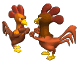
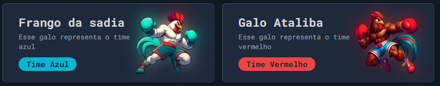
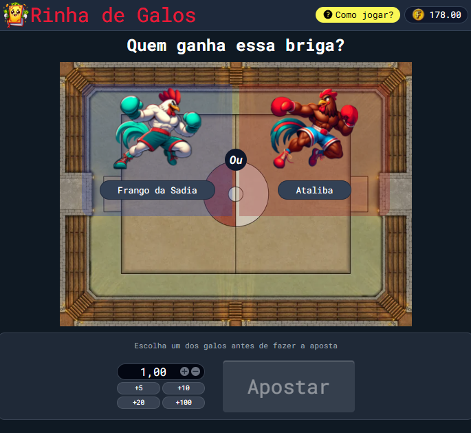
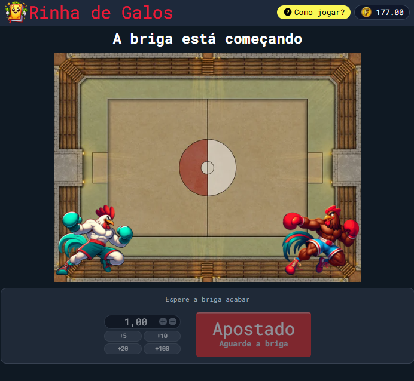

# Rooster Fight Game (Jogo da Rinha de Galo) 🐓

Este é um projeto que simula uma briga de galo, onde o jogador escolhe entre um galo do time vermelho ou um galo do time azul, e eles batalham entre si.

## Visão Geral

O Rooster Fight Game Game é uma simulação de briga de galo feita com HTML, CSS e JavaScript. Nele, os jogadores escolhem um galo para torcer (vermelho ou azul) e assistem à batalha, que tem uma probabilidade de 50% para cada lado ganhar.

O objetivo é simples: escolha o galo que você acha que vai ganhar e veja o resultado da briga!

## Como Jogar

1. Acesse o jogo através deste [link](https://brendon3578.github.io/rooster-fight/src/index.html)
2. Escolha seu galo favorito clicando no galo vermelho ou no galo azul.
3. Assista à batalha entre os galos.
4. Descubra se o seu galo venceu a briga! Cada briga tem uma chance de 50% de vitória para cada galo.

## Tecnologias Utilizadas

- **HTML**: Estrutura básica do jogo.
- **CSS**: Estilização e layout do jogo.
- **JavaScript**: Lógica do jogo, incluindo a simulação da batalha e a determinação do vencedor.

---

<h3 align="center">
    Feito com ☕ por <a href="https://github.com/Brendon3578"> Brendon Gomes</a>
</h3>
